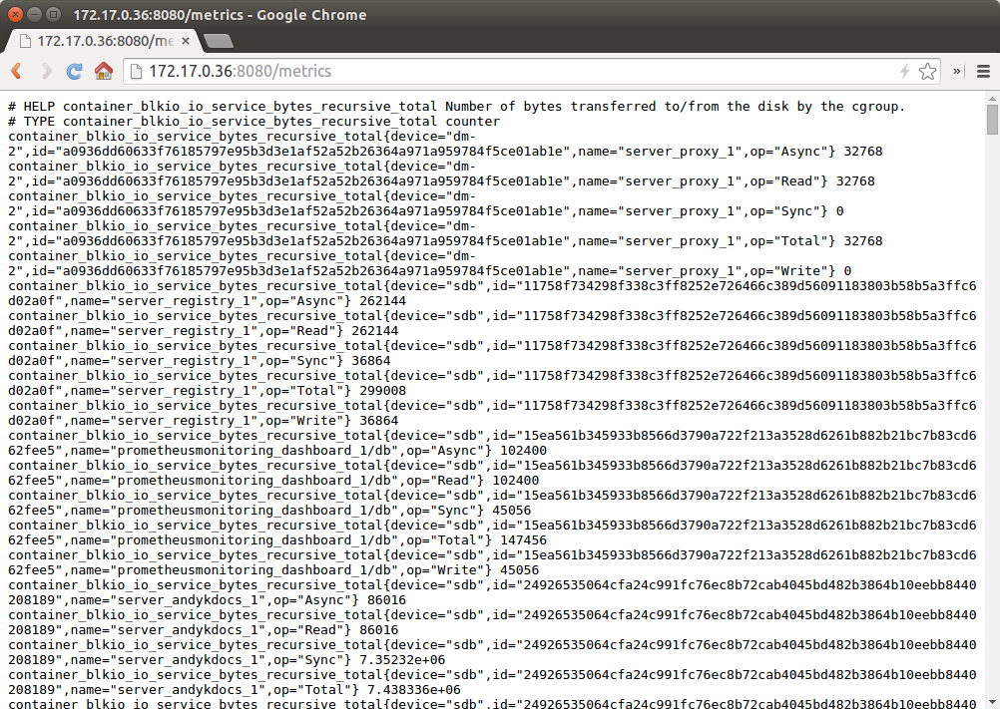
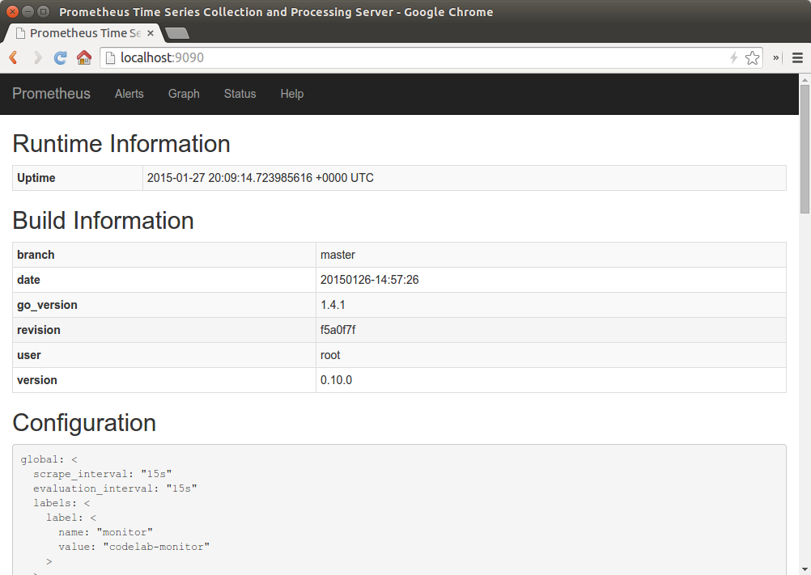
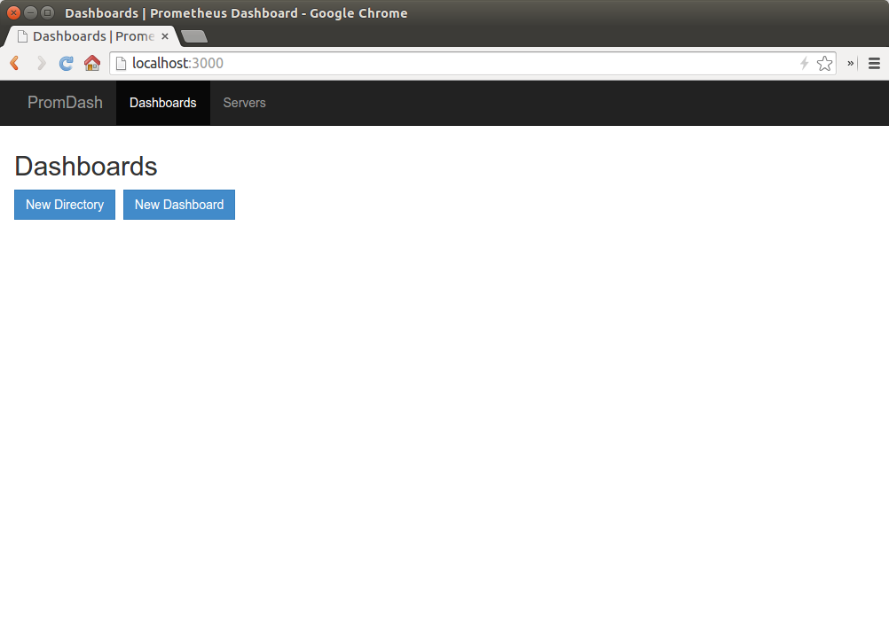
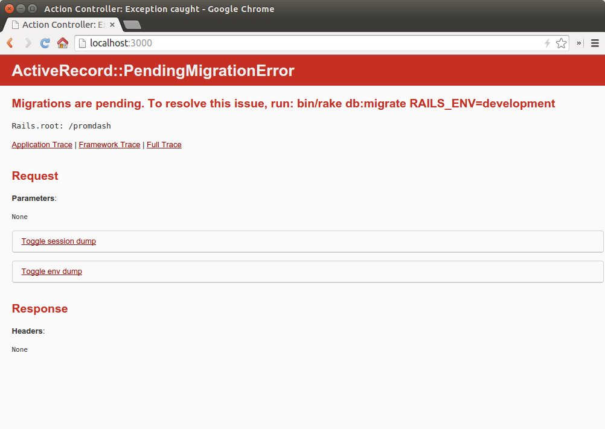

# Prometheus Monitoring for Docker

Monitoring for Docker hosts using Prometheus and fig.

## Requirements

1. Docker
2. fig

## Installation

This repository contains a reference the repository [github.com/docker-infra/container_exporter](https://github.com/docker-infra/container_exporter/) as a submodule. To download this repository with the submodule you must use the `--recursive` flag of the git **clone** command:

```
git clone --recursive git@github.com:andreaskoch/docker-prometheus-monitoring.git
```

After that your repository folder should look something like this:

```
docker-prometheus-monitoring
├── container_exporter
│   ├── devicemap.go
│   ├── Dockerfile
│   ├── docker_manager.go
│   ├── exporter.go
│   ├── main.go
│   ├── manager.go
│   ├── README.md
│   └── _vendor
│       └── ...
├── fig.yml
├── files
│   └── screenshots
├── prometheus.conf
└── README.md
```

## Usage

```bash
fig up -d
```

This will start three components:

```
              Name                            Command               State           Ports          
--------------------------------------------------------------------------------------------------
prometheusmonitoring_dashboard_1   ./run ./bin/thin start           Up      0.0.0.0:3000->3000/tcp 
prometheusmonitoring_db_1          /entrypoint.sh mysqld            Up      3306/tcp               
prometheusmonitoring_metrics_1     ./container-exporter             Up      8080/tcp               
prometheusmonitoring_monitor_1     /go/src/github.com/prometh ...   Up      0.0.0.0:9090->9090/tcp 
```

1) A metrics server at that uses [docker-infra/container_exporter](https://github.com/docker-infra/container_exporter) to expose your docker metrics.



2) The [Prometheus Monitor](https://prometheus.github.io/) at `http://localhost:9090`



3) And a [Prometheus Dashboard](https://prometheus.github.io/docs/visualization/promdash/) at `http://localhost:3000` that allows you to place different metrics into customized dashboards.




## Troubleshooting

### Dashboard

#### ActiveRecord::PendingMigrationError



> Migrations are pending. To resolve this issue, run: bin/rake db:migrate RAILS_ENV=development

To solve the issue send the mentioned command to the dashboard container:

```bash
docker exec prometheusmonitoring_dashboard_1 bash -c "bin/rake db:migrate RAILS_ENV=development"
```
